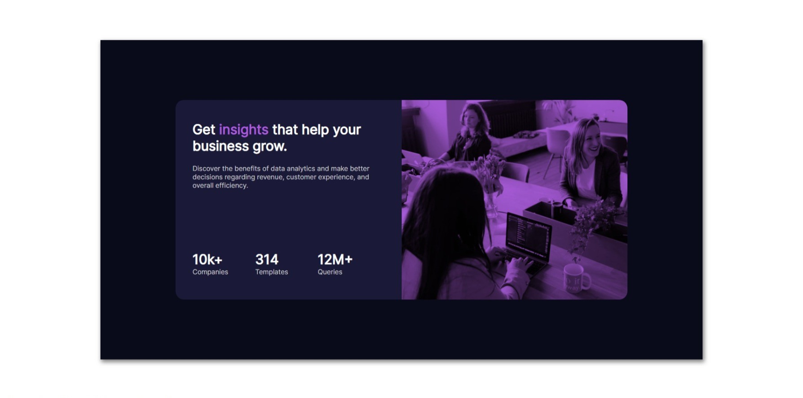

# Frontend Mentor - Stats preview card component solution

This is a solution to the [Stats preview card component challenge on Frontend Mentor](https://www.frontendmentor.io/challenges/stats-preview-card-component-8JqbgoU62). Frontend Mentor challenges help you improve your coding skills by building realistic projects. 

## Table of contents

- [Overview](#overview)
  - [The challenge](#the-challenge)
  - [Screenshot](#screenshot)
  - [Links](#links)
- [My process](#my-process)
  - [Built with](#built-with)
  - [What I learned](#what-i-learned)
  - [Continued development](#continued-development)
  - [Useful resources](#useful-resources)
- [Author](#author)
- [Acknowledgments](#acknowledgments)

**Note: Delete this note and update the table of contents based on what sections you keep.**

## Overview

### The challenge

Users should be able to:

- View the optimal layout depending on their device's screen size

### Screenshot



### Links

- Solution URL: [Add solution URL here](https://github.com/cybercoder-naj/stats-preview-card-component-main.git)
- Live Site URL: [Add live site URL here](https://cybercoder-naj.github.io/stats-preview-card-component-main/)

## My process

### Built with

- Semantic HTML5 markup
- CSS custom properties
- Flexbox

### What I learned

I learnt the implementation of what I have learnt about CSS over the past couple of months, and translated it to a simple challenge.

I used variables in CSS for the first time and it helped in referencing them later in the stylesheet.

```css
:root {
  --primary-dark-blue: hsl(233, 47%, 7%);
  --font-size: 15px;
  --mobile-width: 375px;
  
  // etc.
}
```

Also, I learnt the core features of flexbox and used the `order` property to change the position of the items inside the flexbox.

```css
@media screen and (max-width: 375px) {
  .right {
    order: 1;
  }

  .left {
    order: 2;
  }
}
```

### Useful resources

- [Web Dev Simplified - Flexbox tutorial](https://www.youtube.com/watch?v=fYq5PXgSsbE) - This helped me for understanding the core features of flex-box and changing the order of elements using the order property.

## Author

- Frontend Mentor - [@cybercoder-naj](https://www.frontendmentor.io/profile/cybercoder-naj)
- LinkedIn - [Nishant Aanjaney Jalan](https://www.linkedin.com/in/nishant-aanjaney-jalan-3b7659191/)